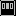
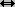
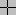
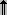
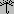

# 第5节：标准属性(attributes)

在查看控件之前，让我们先看一下它们的一些常见属性(如大小、颜色和字体)是如何指定的。

+ 每个小部件都有一组影响其外观和行为属性的选项，例如字体，颜色，尺寸，文本标签等。

+ 您可以在调用小部件的构造函数时使用关键字参数指定选项，例如`text='PANIC!'`或`height=20`。

+ 创建小部件之后，可以使用小部件的.config()方法更改任何选项。您可以通过使用小部件的.cget()方法检索任何选项的当前设置。有关这些方法的更多信息，请参见第26节，通用小部件方法。

## 5.1 尺寸(Dimensions)

小部件的各种长度、宽度和其他尺寸可以用许多不同的单位来描述。

+ 如果您将尺寸设置为整数，则假定它以像素为单位。

+ 可以通过将尺寸设置为数字加下面👇字符来指定单位：

<center><small>**表 3. 尺寸单位**</small></center>

| 字符      | 意思 |
| :--------: | -------- |
|**c**|厘米|
|**i**|英寸|
|**m**|毫米|
|**p**|打印机的点（约1/72英寸）|


## 5.2 坐标系统

与大多数现代显示系统一样，每个坐标系的原点位于其左上角，x坐标向右递增，y坐标向下递增：
<figure markdown="span">
  
  <figcaption>{++现代显示系统坐标示意图++}</figcaption>
</figure>

基本单位是像素，左上角像素的坐标为(0,0)。指定为整数的坐标总是以像素表示，但任何坐标都可以指定为尺寸数量;见第5.1节，尺寸。


## 5.3 颜色

在Tkinter中有两种一通用的方法来指定颜色。

+ 可以使用十六进制字符串指定红、绿、蓝的比例

|十六进制字符串|意义描述|
|:-------:|-------|
|**#rgb**|每个颜色四位|
|**#rrggbb**|每颜色八位|
|**#rrrgggbbb**|每颜色十二位|

例如，“#fff”为白色，“#000000”为黑色，“#000fff000”为纯绿色，“#00ffff”为纯青色(绿色加蓝色)。

+ 还可以使用任何本地定义的标准颜色名称。'white', 'black', 'red', 'green', 'blue', 'cyan', 'yellow'和'magenta'是一定可用，其他名称可能会起作用，具体取决于你的本地安装。


## 5.4 字体

根据你的系统平台，可能有多达三种方法来指定字体类型样式。

+ 作为一个元组，其第一个元素是字体族，后跟一个大小(如果为正，则以点数为单位，如果为负，则以像素为单位)，可选地后跟一个包含一个或多个样式修饰符的字符串：bold（加粗）, italic（斜体）, underline（下划线）, 和 overstrike（阴影）.
  
    Examples: ('Helvetica', '16') for a 16-point Helvetica regular; ('Times', '24', 'bold italic') for a 24-point Times bold italic. For a 20-pixel Times bold font, use ('Times', -20, 'bold').

+ 可以通过导入tkFont模块并使用其Font类构造函数来创建字体对象:

```python
import tkFont

font = tkFont.Font(option, ...)
```
其中选项包括

|选项字段|意义描述|
|:-------:|-------|
|`family`|字体族名称字符串|
|`size`|以点为单位的整型字体高度。要获得n像素高的字体，请使用-n|
|`weight`|“bold”表示粗体，“normal”表示正常重量|
|`slant`|'italic'表示斜体，'roman'表示不倾斜|
|`underline`|1表示带下划线的文本，0表示普通文本|
|`overstrike`|1表示阴影文本，0表示正常文本|

例如，要获得36点粗体的Helvetica斜体

```python
helv36 = tkFont.Font(family='Helvetica',
        size=36, weight='bold')
```
+ 如果您在X窗口系统下运行，则可以使用任何X字体名称。例如，名为`-*- lucidattypewriter -medium-r-*-*-*-140-*-*-*-*-*-* -*-*`的字体是一个很好的屏幕上使用的等宽字体。使用`xfontsel`程序来帮助你选择令人满意的字体。

要获取平台上可用的所有字体系列的列表，请调用此函数：

```python
tkFont.families()
```

返回值是一个字符串列表。注意:你必须在调用这个函数之前创建你的根窗口。

下面这些方法在所有`Font`对象上都有定义：


!!! info ".actual(option=None)"
    如果不传递任何参数，则返回一个包含字体实际属性的字典，该字典可能与您所请求的不同。要获取属性的值，请将其名称作为参数传递。

!!! info ".cget(option)"
    

!!! info ".configure(option, ...)"
    

!!! info ".copy()"
    

!!! info ".measure(text)"


!!! info ".metrics(option)"
    如果不带参数调用此方法，它将返回包含所有字体指标的字典。您可以通过将一个指标的名称作为参数传递来检索它的值。指标包括
| 指标名称 | 意义描述 |
| :--------: | ------- |
|`ascent`|基线和最高上限的顶部之间的高度像素数量。|
|`descent`|基线和最高上限的底部之间的高度像素数量。|
|`fixed`|对于可变宽度字体，此值为0，对于等宽字体，此值为1。|
|`linespace	`|总高度的像素数。这是给定字体的实字集的行距|


## 5.5 锚点(Anchors)

Tkinter模块定义了许多锚常量，您可以使用它们来控制项相对于其上下文的位置。例如，当框架大于小部件时，锚可以指定小部件在框架中的位置。

这些常数被作为指南针点，北向上，向西向左。我们就这种[北半球的沙文主义](http://flourish.org/upsidedownmap/)向南半球的读者致歉。[^1]

锚点常数如图所示


<figure markdown="span">
  {  align="center"}
  <figcaption>锚点常数{++(中国人直接记上北下南左西右东)++}</figcaption>
</figure>

例如，如果您在一个大框架中创建一个小部件，并使用anchor=tk。SE选项，小部件将被放置在框架的右下角。如果使用anchor=tk。相反，小部件将沿着上边缘居中。

锚也用于定义文本相对于参考点的位置。例如，如果您将tk.center用作文本锚，则文本将在参考点围绕水平和垂直居中。锚tk.nw将定位文本，以使参考点与包含文本的盒子的西北（左上角）一致。锚点TK.W将垂直围绕参考点的文本中心，文本框的左边缘通过该点，依此类推。

## 5.6 Relief 样式

小部件的浮雕样式是指围绕小部件外部的某种模拟三维效果。这是一排按钮的屏幕截图，展示了所有可能的浮雕样式

<figure markdown="span">
  {  align="center"}
  <figcaption><small>所有可能的浮雕样式</small></figcaption>
</figure>

这些边框的宽度取决于小部件的borderwidth选项。上图显示了它们在5像素边框下的样子;默认的边框宽度是2。


## 5.7 位图

对于小部件中的`bitmap`位图选项，下面这些位图保证可用：


<figure markdown="span">
  {  align="center"}
  <figcaption><small>标准位图</small></figcaption>
</figure>

上图显示了带有标准位图的按钮控件。从左到右分别是`'error'`(), `'gray75'`(), `'gray50'`(), `'gray25'`(), `'gray12'`(), `'hourglass'`(), `'info'`(), `'questhead'`(), `'question'`(), 和 `'warning'`().

你可以使用你自己的位图。任何`.xbm` (X位映射)格式的文件都可以工作。在标准位图名称的位置，使用字符串'@'后跟.xbm文件的路径名。

## 5.8 鼠标指针光标

有很多不同的鼠标指针光标可用。他们的名字和图片显示在这里。具体的图形可能因操作系统而异。

|光标|对应字符串|光标|对应字符串|
|:-------:|-------|:-------:|-------|
||arrow||		man|
||based_arrow_down||		middlebutton|
||based_arrow_up||		mouse|
||boat||		pencil|
||bogosity||		pirate|
||bottom_left_corner||		plus|
||bottom_right_corner||		question_arrow|
||bottom_side||		right_ptr|
||bottom_tee||		right_side|
||box_spiral||	right_tee|
||center_ptr||		rightbutton|
||circle||		rtl_logo|
||clock||		sailboat|
||coffee_mug||		sb_down_arrow|
||cross||		sb_h_double_arrow|
||cross_reverse||		sb_left_arrow|
||crosshair||		sb_right_arrow|
||diamond_cross||		sb_up_arrow|
||dot||		sb_v_double_arrow|
||dotbox||		shuttle|
||double_arrow||		sizing|
||draft_large	||	spider|
||draft_small	||	spraycan|
||draped_box	||	star|
||exchange||		target|
||fleur||		tcross|
||gobbler	||	top_left_arrow|
||gumby||		top_left_corner|
||hand1||		top_right_corner|
||hand2||		top_side|
||heart||		top_tee|
||icon||		trek|
||iron_cross||		ul_angle|
||left_ptr||		umbrella|
||left_side||		ur_angle|
||left_tee||		watch|
||leftbutton	||	xterm|
||ll_angle||		X_cursor|
||lr_angle|     |	 	 |


## 5.9 图片

在Tkinter应用程序中显示图形图像有三种通用方法。

+ 要以`.xbm`格式显示位图(双色)图像，请参阅第5.9.1节，BitmapImage类。
+ 要以`.gif`、`.pgm`或`.ppm`格式显示彩色图像，请参见第5.9.2节PhotoImage类。
+ Python图像库(PIL)支持更多种格式的图像。它的ImageTk类是专门为在Tkinter应用程序中显示图像而设计的。有关PIL文档，请参阅作者的配套文档:{~~[Python PIL快速参考]()~>[Pillow (PIL Fork) 10.3.0 文档 ImageTk模块](https://pillow.readthedocs.io/en/stable/reference/ImageTk.html)~~}。

### 5.9.1 `BitmapImage`类
要以`.xbm`格式显示位图(双色)图像，需要使用下面这个构造函数:

```python
tk.BitmapImage(file=f[, background=b][, foreground=c])
```


```python
logo = tk.BitmapImage('logo.xbm', foreground='red')
Label(image=logo).grid()
```

### 5.9.2 `PhotoImage`类

要以`.gif`、`.pgm`或`.ppm`格式显示彩色图像，需要这个构造函数:

```python
tk.PhotoImage(file=f)
```

`f`是图片文件的名字。构造函数返回一个可以在Tkinter任何需要图像的地方使用的值。

## 5.10 几何字符串

## 5.11 窗口名称

## 5.12 Cap和join样式

## 5.13 虚线图型(dash)

## 5.14 匹配点画图型(stipple)

[^1]: 想不明白位置标识为啥不用上下左右，而是用东西南北这种傻逼设计